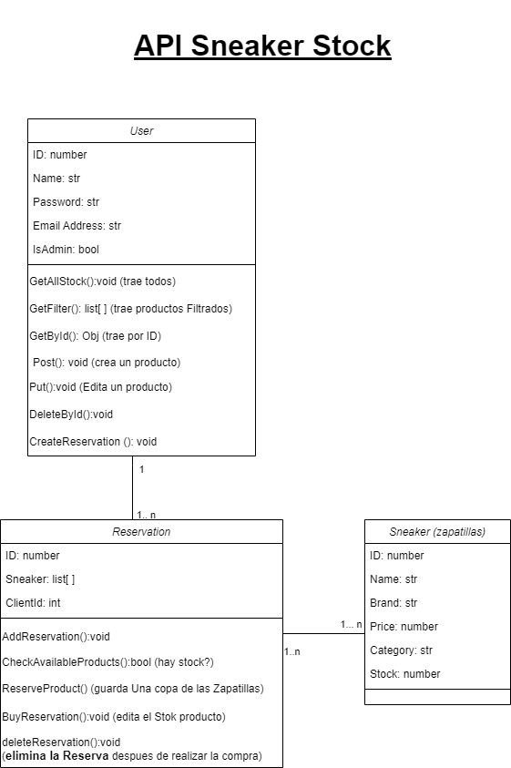

# Trabajo Practico Integrador Progamacion 3.

## Integrantes:
    **Rustici, Anabella**
    **Romero Barrios, Nicolas Alejandro**
    **Isaguirre, Maria Delfina**
    

## Contexto:
Nuestra API REST facilita la gestión del stock en tiendas de zapatillas, ofreciendo funcionalidades completas tanto para empleados
como para clientes. Permite realizar operaciones de ingreso, egreso, eliminación y modificación de productos, así como reservas y
consultas para clientes, y acceso completo a la gestión de stock para administradores. Ambos pueden filtrar productos y recibir
notificaciones claras sobre el éxito o fracaso de las operaciones realizadas.

## Requerimientos:
1. Permitir iniciar sesión o registrarse
2. Validar usuario
3. Visualización de los productos
4. Filtrar la Visualización de productos
5. Cliente: agregar o eliminar productos de sus reservas
6. Dueño: añadir nuevos productos, modificar o eliminar un producto

## Diagrama de Clases: 

